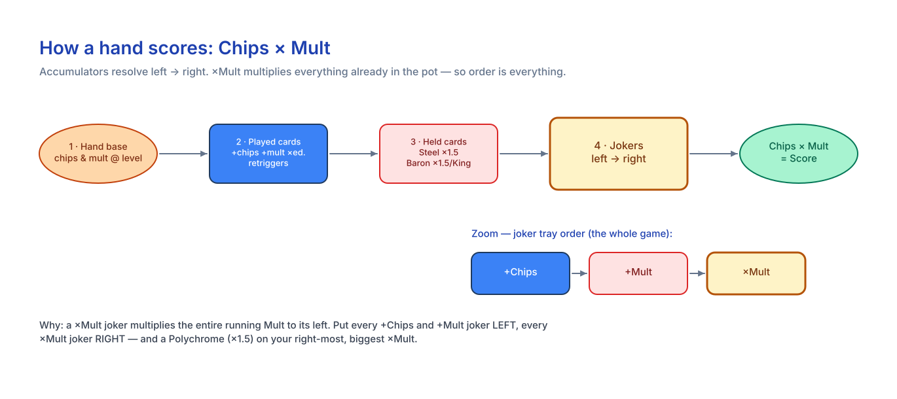
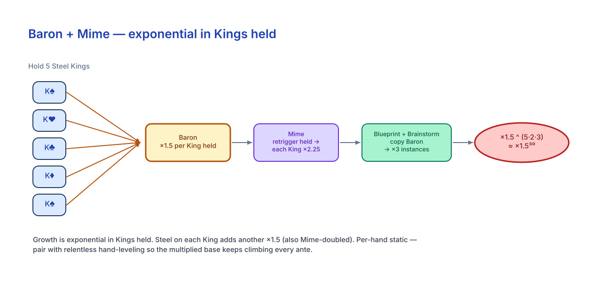
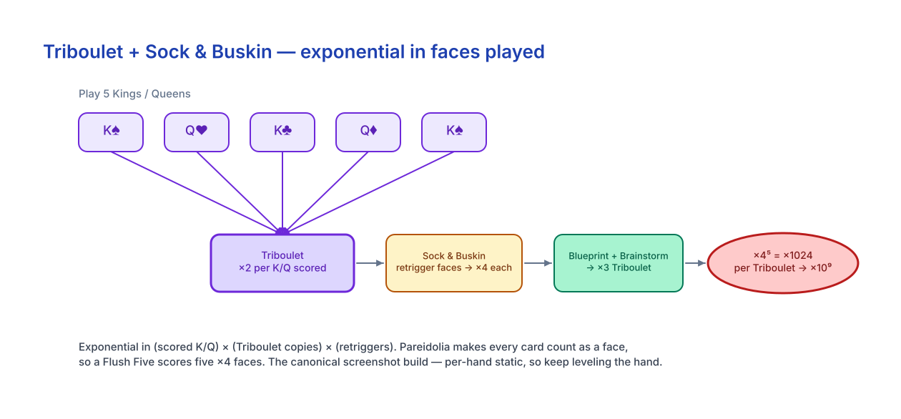
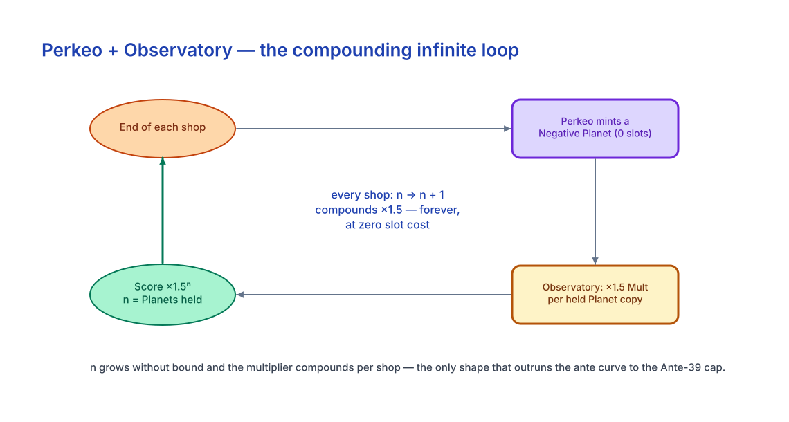
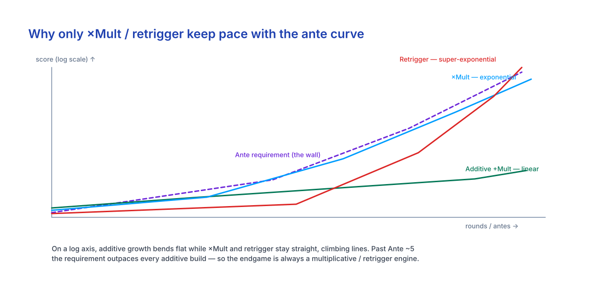

# The Balatro Endless Handbook
### A competitive reference for infinite / endless scaling

> Companion to the interactive app (live score **Simulator**, **Tier List**, growth **Charts**, and **Ante Route** planner). This handbook is the offline reference — every number here drives the app's typed data, and vice-versa.

---

## 1. How to use this handbook

This is a **scaling-meta reference for competitive players chasing infinite (endless-mode) scores** — it supersedes any beginner framing. The goal is not to "win Ante 8"; it is to build a **multiplicatively compounding engine** that keeps pace with an exponential score curve all the way to the Ante-39 hard cap.

Pair it with the interactive app:
- **Simulator** — type in a hand + jokers and watch Chips × Mult resolve phase-by-phase.
- **Tier List** — sortable S/A/B builds with ceiling/consistency/setup/fragility.
- **Charts** — score-growth curves vs. the ante requirement curve.
- **Ante Route** — the per-ante buy/keep/reroll plan for each S-tier build.

How to read it: **bold text marks a decision trigger** ("do X when Y"). Tables hold the exact numbers. Non-obvious figures are cited inline — `(balatrowiki.org)` for mechanics/tables, `(cards.js)` for exact joker config/rarity/cost from the open-source efhiii/balatro-calculator. Full source list at the end.

**The one idea that matters:** score is a *product*, `Chips × Mult`. Additive bonuses plateau; **multiplicative and retrigger effects are the only things that scale into endless.** Everything below is in service of building one of those.

---

## 2. Scoring identity & order of operations

```
Hand Score = Chips × Mult
```
`(balatrowiki.org/w/Score)` — a blind's total is the **sum** of every hand's score. `Chips` and `Mult` are two independent running accumulators; you pump both, but because they multiply, **×Mult dominates.**

### The five phases `(Steam guide id=3169032575)`

| Phase | What resolves |
|---|---|
| **0 — Pre-mods** | Hand-level changes (Space Joker, The Arm −1, Burnt). **The Flint halves base chips & mult, rounded up.** |
| **1 — Base hand** | Seed Chips/Mult from the poker hand's base at its current level (§3). |
| **2 — Scored cards (LEFT→RIGHT)** | Per card: chip value (2–10 = face, **J/Q/K = 10, A = 11**) → enhancement → edition (Foil +50 chips, Holo +10 mult, Poly ×1.5) → seal (Gold $3, Red = retrigger) → joker retriggers (Hack/Sock&Buskin/Hanging Chad/Dusk/Seltzer). |
| **3 — Held cards (LEFT→RIGHT)** | Steel ×1.5, King+Baron ×1.5, Queen+Shoot-the-Moon +13; **Mime retriggers all held effects;** Red seal retriggers. |
| **4 — Jokers (LEFT→RIGHT)** | Each joker in tray order. Joker Foil/Holo apply *before* its effect, **Poly ×1.5 applies *after*.** Scaling jokers upgrade before they pay out. |

*(Phase 5: Plasma Deck averages Chips & Mult before the final multiply.)*

### Why joker ORDER is the whole game

Mult is one accumulator read left→right, so a `×Mult` joker multiplies **everything to its left.**

> **Rule: `+Chips` and `+Mult` jokers on the LEFT, `×Mult` jokers on the RIGHT.** Put your biggest Polychrome on the right-most ×Mult joker.

`+30 mult then ×4` → (base+30)×4. Reversed wastes the +30. Multiple ×Mult jokers commute among themselves but must all sit right of every additive source.

### Retriggers (the backbone of held-card engines) `(cards.js)`

| Joker | Effect | Rarity / $ |
|---|---|---|
| Hack | Retrigger each played **2,3,4,5** once | Uncommon / 6 |
| Sock and Buskin | Retrigger all played **face cards** once | Uncommon / 6 |
| Hanging Chad | Retrigger **first** scored card **2 more** times (3 total) | Common / 4 |
| Dusk | Retrigger all played cards on the **final hand of round** | Uncommon / 5 |
| Seltzer | Retrigger all played cards for **10 hands**, then self-destructs | Uncommon / 6 |
| Mime | Retrigger all **held-in-hand** abilities once | Uncommon / 5 |
| Red seal (card) | Retrigger that card once | — |

A retrigger re-runs the card's full scoring, so a retriggered Glass card re-applies ×1.5, a retriggered held King re-applies Baron's ×1.5. **This is how a single hand reaches astronomical multipliers.**

---

## 3. Poker hand table `(balatrowiki.org/w/Poker_Hands)`

| Hand | L1 Chips × Mult | Planet | +Chips / +Mult per level |
|---|---|---|---|
| High Card | 5 × 1 | Pluto | +10 / +1 |
| Pair | 10 × 2 | Mercury | +15 / +1 |
| Two Pair | 20 × 2 | Uranus | +20 / +1 |
| Three of a Kind | 30 × 3 | Venus | +20 / +2 |
| Straight | 30 × 4 | Saturn | +30 / +3 |
| Flush | 35 × 4 | Jupiter | +15 / +2 |
| Full House | 40 × 4 | Earth | +25 / +2 |
| Four of a Kind | 60 × 7 | Mars | +30 / +3 |
| Straight Flush | 100 × 8 | Neptune | +40 / +4 |
| Royal Flush | 100 × 8 | (levels w/ Straight Flush) | +40 / +4 |
| **Five of a Kind** † | 120 × 12 | Planet X | +35 / +3 |
| **Flush House** † | 140 × 14 | Ceres | +40 / +4 |
| **Flush Five** † | 160 × 16 | Eris | +50 / +3 |

† Secret hands (need enhancement/deck setups) — the **highest base values in the game** and the preferred scoring hands for top endless builds.

**Worked example (Flush):** L1 = 35×4, +15/+2 per level → **L5 = 95×12**, L10 = 170×22. Levels are uncapped.

> **Level ONE hand relentlessly.** Leveling raises both the chip seed and the additive base mult, building the pot your ×Mult jokers then explode. Endless winners funnel every planet (Telescope-targeted Celestial packs, Observatory, Constellation/Astronomer) into a single hand — usually Flush or a secret Flush-X — rather than spreading them.

---

## 4. Ante requirements & the endless wall

Within an ante: **Small = 1×, Big = 1.5×, Boss = 2×** the base `(balatrowiki.org/w/Blinds)` (some bosses override — §9).

### Base requirement, antes 1–8 (White Stake) `(balatrowiki.org/w/Ante)`

| Ante | 1 | 2 | 3 | 4 | 5 | 6 | 7 | 8 |
|---|---|---|---|---|---|---|---|---|
| Chips | 300 | 800 | 2,000 | 5,000 | 11,000 | 20,000 | 35,000 | 50,000 |

*(Higher stakes raise antes 2–8: Green+ → A8 = 100k, Purple+ → A8 = 200k.)*

### Endless checkpoints (the numbers the game checks) `(balatrowiki.org)`

| Ante | 9 | 10 | 12 | 16 | 20 | 30 | 39 |
|---|---|---|---|---|---|---|---|
| Required | 110k | 560k | 3.0×10⁸ | 8.6×10²⁰ | 4.3×10⁴³ | 2.1×10¹⁴⁹ | 4.8×10³⁰⁹ |

> **The Ante-39 "naneinf" wall.** At A39 the requirement (~4.8e309) exceeds the double-precision float ceiling (~1.8e308) and overflows to **NaN** — every score-check fails, making **Ante 39 the practical hard cap of endless.** Reaching/surviving A39 is the community "win."

Growth is **exponential** — roughly ×5/ante early-endless, climbing to ×10–×100+/ante by the late 20s–30s. **Only multiplicative + retrigger engines that compound per round keep pace.** Additive-mult builds (§7 B-tier) die in the teens.

---

## 5. Competitive joker reference

Exact `config` values, rarity, and base cost from `(cards.js)`. Rarity: Common / Uncommon / Rare / Legendary.

### Chip jokers (additive — left side)
| Joker | Effect | Rarity / $ |
|---|---|---|
| Sly / Wily / Clever / Devious / Crafty | +50/+100/+80/+100/+80 chips if hand has Pair/3oaK/2Pair/Straight/Flush | Common / 3–4 |
| Banner | +30 chips per remaining discard | Common / 5 |
| Bull | +2 chips per dollar held | Uncommon / 6 |
| Blue Joker | +2 chips per card left in deck (~+104 full) | Common / — |
| Stone Joker | +25 chips per Stone in deck | Uncommon / 6 |
| Stuntman | +250 chips, −2 hand size | Rare / 7 |

### Additive-mult jokers (left side)
| Joker | Effect | Rarity / $ |
|---|---|---|
| Joker | +4 mult | Common / 2 |
| Jolly/Zany/Mad/Crazy/Droll | +8/+12/+10/+12/+10 mult on Pair/3oaK/2Pair/Straight/Flush | Common / 3–4 |
| Half Joker | +20 mult if hand ≤ 3 cards | Common / 5 |
| Mystic Summit | +15 mult if 0 discards left | Common / 5 |
| Fibonacci | +8 mult per A/2/3/5/8 | Uncommon |
| Even Steven / Odd Todd | +4 mult per even / +31 chips per odd | Common / 4 |
| Scary Face / Smiley Face | +30 chips / +5 mult per face card | Common / 4 |
| Walkie Talkie | +10 chips & +4 mult per 10 or 4 | Common / 4 |

### Scaling additive-mult (grow over the run)
| Joker | Scaling rule | Rarity / $ |
|---|---|---|
| Supernova | +mult = times this hand has been played | Common / 5 |
| Ride the Bus | +1 mult per consecutive no-face hand (resets on face) | Common / 6 |
| Green Joker | +1 mult per hand, −1 per discard | Common / 4 |
| Flash Card | +2 mult per shop reroll | Uncommon / 5 |
| Spare Trousers | +2 mult per Two Pair played | Uncommon / 6 |
| Runner / Square / Castle / Wee | +15/+4/+3/+8 chips per trigger (Straight / 4-card hand / disc. suit / scored 2) | Common–Rare |
| Hiker | every scored card permanently +5 chips | Uncommon |

### ×Mult jokers (right side — the payoff)
| Joker | Effect | Rarity / $ |
|---|---|---|
| Duo / Trio / Family / Order / Tribe | ×2/×3/×4/×3/×2 if hand has Pair/3oaK/4oaK/Straight/Flush | Rare / 8 |
| Card Sharp | ×3 if this hand type already played this round | Uncommon / 6 |
| Cavendish | ×3 (1-in-1000 self-destruct/round) | Common / 4 |
| Photograph | first scored face card ×2 | Common / 5 |
| Baseball Card | each Uncommon joker ×1.5 | Rare / 8 |
| **Hologram** | gains **×0.25 per card added to deck** | Uncommon / 7 |
| **Constellation** | gains **×0.1 per Planet used** | Uncommon / 6 |
| **Vampire** | gains **×0.1 per scoring enhanced card** (strips enhancement) | Uncommon / 7 |
| **Lucky Cat** | gains **×0.25 per successful Lucky trigger** | Uncommon / 6 |
| **Glass Joker** | gains **×0.75 per Glass card destroyed** | Uncommon / 6 |
| **Obelisk** | gains **×0.2 per consecutive non-most-played hand** | Rare / 8 |
| **Campfire** | gains **×0.25 per card sold** (resets on Boss) | Rare / 9 |
| **Baron** | each **King held** = **×1.5** | Rare / 8 |
| **Steel Joker** | ×(1 + 0.2·n) for n Steel cards in deck | Uncommon / 7 |

### Copy jokers
| Joker | Effect | Rarity / $ |
|---|---|---|
| **Blueprint** | Copies the joker to its **RIGHT** | Rare / 10 |
| **Brainstorm** | Copies the **left-most** joker | Rare / 10 |

Copies inherit the target's *current scaled value*. Two copy-jokers + one engine joker = **three instances.** The cheapest way to double/triple an engine.

### Economy / enablers
To the Moon (+$1 interest per $5, raises cap) · Rocket ($1 +$2/Boss) · Cloud 9 ($1 per 9 in deck) · Golden Ticket ($4/Gold card) · Egg (+$3 sell/round) · Credit Card (−$20 debt) — all Common/Uncommon. Buy time to assemble the engine.

### Legendary (Soul-card only, rarity Legendary, base $20) `(cards.js)`
| Joker | Effect | Why it matters |
|---|---|---|
| **Triboulet** | Kings & Queens each **×2** when scored | With Sock&Buskin (×2 trigger) → ×4 per face; copies stack exponentially. |
| **Perkeo** | End of shop: **Negative copy of 1 random held consumable** | Powers the #1 infinite loop (§6) — duplicate a Planet every shop at no slot cost. |
| **Yorick** | gains **×1 per 23 cards discarded** | Slow but unbounded ×Mult. |
| **Canio** | gains **×1 per face card destroyed** | Unbounded ×Mult fed by Glass/destruction. |
| **Chicot** | **Disables every Boss Blind effect** | Universal endless safety valve (§9). |

---

## 6. Infinite engines

A joker that gains a fixed amount per action is **linear**; two feeding each other, or one that compounds per round, is **quadratic/exponential**; a loop that multiplies a quantity that *itself grows every shop* is **super-exponential / truly infinite** — the only shape that outruns §4's curve into the 30s.

### 6.1 Baron + Mime (Kings-in-hand)
**Pieces:** Baron (held King = ×1.5), Mime (retrigger held), Steel Kings (held Steel = ×1.5), Blueprint/Brainstorm→Baron, Red seals on Kings.
**Math:** Mime retriggers each King's held effect → **×1.5 × ×1.5 = ×2.25 per King.** Total ≈ **×2.25ᵏ** for k Kings; add two Baron copies + Steel + Mime-doubling and each King is ×1.5 to a multi-factor exponent → a single hand multiplies by ×10⁴–×10⁶ from holds alone.
**Growth source:** *exponential in Kings held and retriggers.* Per-hand **static**, so pair it with relentless hand-leveling to stay endless. Run a thin deck to draw Kings reliably.

### 6.2 Triboulet + Sock & Buskin (face cards)
**Pieces:** Triboulet (K/Q ×2 scored), Sock&Buskin (retrigger faces), Pareidolia (all cards count as faces), Blueprint/Brainstorm→Triboulet, Hanging Chad.
**Math:** Sock&Buskin → each scored K/Q = ×2×2 = **×4.** Five K/Q → ×4⁵ = **×1024** from Triboulet alone, before copies (3 ×2 instances per face) and editions.
**Growth source:** *exponential in (scored K/Q) × (Triboulet copies) × (retriggers).* Per-hand static → pair with leveling + Pareidolia to maximize face count. Highest ceiling; the "screenshot" build.

### 6.3 Blueprint / Brainstorm — copy rules & placement
- **Blueprint copies the joker on its RIGHT; Brainstorm copies the LEFT-MOST joker.**
- A copy inherits the target's **current scaled state** (copy of a ×12 Hologram is ×12).
- **Chaining:** a copy-joker can copy another copy-joker → three instances of one engine.
- **Placement:** make your engine joker the **left-most** (for Brainstorm) and put **Blueprint directly left of the engine's adjacency** so both copies land on it. Verify the highest layout in the Simulator. Copy jokers ($10 each) are the single biggest force-multiplier in the game.

### 6.4 Perkeo + Observatory — the true infinite ⭐
**Pieces:** Perkeo, **Observatory voucher** (held Planet card gives **×1.5 mult** to its hand, `balatrowiki.org`), **Telescope** (Celestial packs = your most-played hand's planet), Crystal Ball (+1 consumable slot).
**Loop:**
1. Hold the Planet for your scoring hand → Observatory makes it **×1.5** every time you play that hand.
2. **Perkeo, end of every shop, mints a Negative copy** of a random held consumable. Negative copies **take no slot.**
3. Each held copy = another **×1.5** → after n shops you hold ~n copies → **×1.5ⁿ, compounding every shop, forever, at zero cost.**

**Growth source:** the multiplier is **×1.5^(Planet copies held)**, and copies **increase every shop without bound or resource cost** — *per-shop multiplicative*, exactly the shape needed for Ante 30+. **Community-consensus #1 genuinely-infinite engine.**

### 6.5 Other scaling loops
- **Hologram + Constellation** (polynomial): Hologram ×0.25/card-added, Constellation ×0.1/planet-used — run a deck-add + planet shell, multiply them, copy with Blueprint.
- **Yorick** ×1/23 discards — high-discard, deck-thinning shell.
- **Canio** ×1/face destroyed — feed with Glass faces + Hanging Chad / The Tooth.
- **Glass Joker** ×0.75/Glass destroyed — each Glass card also ×1.5 when scored; self-limiting, replenish with Marble/DNA.
- **Lucky Cat** ×0.25/Lucky trigger — with **Oops! All 6s** (doubles odds) + retriggers, ramps fast; high variance.

---

## 7. Build tier list

| Build | Ceiling | Consistency | Setup | Fragility |
|---|---|---|---|---|
| **S — Perkeo + Observatory + Telescope** | Infinite (×1.5/shop) | High once online | Slow (legendary + 2 vouchers) | **Low** — Chicot-safe; the safest infinite |
| **S — Baron + Mime (+copies, Steel Kings)** | Near-infinite (×1.5ᵏ + leveling) | High (thin deck) | Medium | Med — hand-size & face-debuff bosses, Verdant Leaf |
| **S — Triboulet + Sock & Buskin (+copies, Pareidolia)** | Near-infinite (×4/face) | Med-High | Slow (legendary) | Med-High — face-debuff bosses (The Plant/The Mark) |
| **A — Flush/Secret-Flush leveling + Tribe/Droll** | High | High | Fast | Low — best universal backbone |
| **A — Hologram + Constellation polynomial** | High | High | Medium | Low |
| **A — Glass-cannon / Lucky Cat + Oops!** | High | Medium | Medium | Med (variance / self-limiting) |
| **B — Supernova / Ride the Bus / Green Joker** | Medium (linear) | High | Fast | Falls off vs exponential curve |
| **B — Economy / Stuntman big-chips no-×Mult** | Low | High | Fast | No endless legs |

> **Universal rule:** every endless winner = **(a) a multiplicative engine that compounds per round + (b) one hand leveled relentlessly + (c) Blueprint/Brainstorm to double the engine.** B-tier additive builds are scaffolding you upgrade *out of*.

---

## 8. Ante-by-ante survival routes

Economy spine for all routes: **keep $25+ for the +$5/round interest cap** (To the Moon raises it); reroll only with cash above $25 early; **commit to one scoring hand from Ante 1.**

### Route A — Perkeo + Observatory (safe infinite)
- **A1–3:** Play your most-frequent hand; buy a cheap +mult joker + an economy joker. **Take Telescope the instant it appears.** Bank money.
- **A4–6:** Buy Celestial packs (now hand-targeted), level your hand to L5–8. **Take Observatory.** Grab Crystal Ball to hold the Planet. Keep a defensive joker for bosses.
- **A7–8:** Chase **Perkeo** (Soul/Spectral). The moment Perkeo + Observatory + held Planet align, the loop is live — clear A8 with the multiplied hand.
- **Endless:** Just keep opening Celestial packs (level the hand), hold the Planet, let Perkeo compound each shop. Add Blueprint to copy any ×Mult. **Hold Chicot for nasty bosses.** Ride ×1.5ⁿ to A39.

### Route B — Baron + Mime
- **A1–3:** Thin deck toward Kings; play Pairs/High-card; grab early mult + economy; watch for **Baron**; start making Steel Kings (Arcana).
- **A4–6:** Land **Baron + Mime** (each King ×2.25). Convert Kings to **Steel**; add Red seals if Spectral allows. Level any cheap hand.
- **A7–8:** Add **Blueprint + Brainstorm copying Baron** (3× the held multiplier). Draw a full hand of Steel Kings, play holding max Kings.
- **Endless:** Keep adding Steel Kings (DNA/tarots) + leveling the hand. Manage hand-size bosses (§9).

### Route C — Triboulet + Sock & Buskin
- **A1–4:** Play face-heavy; collect Photograph/Smiley; steer deck toward K/Q.
- **A5–7:** Chase **Triboulet**; add **Sock & Buskin** (each K/Q ×4) and **Pareidolia**.
- **A8 → endless:** Add **Blueprint + Brainstorm copying Triboulet**; play your highest-base face hand (Five of a Kind / Flush House of Kings), level it with Telescope. **Hold Chicot for The Plant/The Mark.**

---

## 9. Boss-blind threats & counterplay `(balatrowiki.org/w/Blinds)`

| Boss | Effect | Counterplay |
|---|---|---|
| **The Wall** | 4× base chips | Score check only — S-tier ignores; weaker builds pre-level / save a ×Mult spike. |
| **The Needle** | 1 hand, 1× base | **Favors** one-nuke engines (often the easiest boss for S-tier). Kills grinders. |
| **The Manacle** | −1 hand size | Hurts **Baron+Mime** (one fewer King). Buffer hand-size or Chicot/Luchador. |
| **The Psychic** | Must play 5 cards | Fewer Kings held for Baron — hold what you can, or Chicot. |
| **Verdant Leaf** | All cards debuffed until you **sell a Joker**; 2× | Catastrophic for all card-scoring builds. **Keep one sacrificial joker**, or Chicot. |
| **The Plant** | Debuffs **face cards** (A4+) | Kills Triboulet/Baron. **Chicot / Luchador**, or play a non-face hand. |
| **The Mark** | Face cards drawn face-down | Same victims — Chicot/Luchador or a non-face hand. |
| **The Head** | Debuffs Hearts | Reroute suit or Chicot. |
| **The Ox** | Most-played hand → $0 | Play a different hand once; single-hand engines eat one $0. |
| **The Eye / The Mouth** | No repeat / one hand type only | Have a second viable hand, or one-shot the blind. |
| **The Flint** | Halves base chips & mult | Keep the hand leveled — ×Mult engines barely notice. |
| **The Water** | 0 discards | Hurts discard-scalers (Yorick) — play hand-only. |
| **The Arm** | −1 hand level | Minor at high levels; play another leveled hand. |

> **Universal boss insurance:** carry **Chicot** (disables *all* boss effects) or **Luchador** (sell to disable the current boss), and reserve **one sacrificial Joker** for Verdant Leaf. These three neutralize essentially every engine-disrupting boss — deep-endless S-tier always reserves a slot for insurance.

---

## Diagrams

Visual references for the scoring math and each infinite engine (open the interactive app for the
live simulator). Source files: `diagrams-src/*.excalidraw` (editable at excalidraw.com).

**Scoring activation sequence**



**Baron + Mime — exponential in Kings held**



**Triboulet + Sock & Buskin — exponential in faces played**



**Perkeo + Observatory — the compounding infinite loop**



**Why only ×Mult / retrigger keep pace**



---

## 10. One-page cheat sheet

**Scoring:** `Score = Chips × Mult`. Phases: 0 pre-mods (Flint halves base) → 1 base hand → 2 scored cards L→R → 3 held cards (Mime/Baron/Steel) → 4 jokers L→R.

**Joker order:** **+Chips / +Mult LEFT · ×Mult RIGHT.** Polychrome (×1.5) on the right-most ×Mult joker. Card values: 2–10 face, **J/Q/K = 10, A = 11.**

**Hand priority:** **level ONE hand forever** (Flush, or a secret Flush-X at 160×16). Telescope targets it; Observatory ×1.5 it; Constellation/Astronomer feed it.

**Ante checkpoints:** A8 = 50k → A12 = 3.0e8 → A20 = 4.3e43 → **A39 = naneinf (the cap).** Only multiplicative/retrigger engines keep pace.

**The three engine recipes (joker list + placement):**
1. **Perkeo loop** ⭐ — Perkeo + Observatory + Telescope (+ Crystal Ball). Hold your hand's Planet; Perkeo mints negative copies each shop → ×1.5ⁿ forever.
2. **Baron+Mime** — `[Brainstorm][Baron][Blueprint] + Mime`, full hand of **Steel Kings** + Red seals. Each King ≈ ×1.5 to a stacked exponent.
3. **Triboulet** — `[Brainstorm][Triboulet][Blueprint] + Sock & Buskin + Pareidolia`. Play all-K/Q (Five of a Kind / Flush House); each face ×4+.

**Economy thresholds:** hold **≥ $25** (interest floor); interest caps at **+$5/round** (To the Moon raises it); spend only surplus above $25 early.

**Per-round checklist:**
- **BUILD:** Is my one hand getting leveled this round? (open/buy a Celestial pack if not.)
- **BUY:** engine piece > copy joker > ×Mult > economy > +mult. Editions: Polychrome on the right-most ×Mult, Negative on any joker (free slot).
- **HOLD:** Kings (Baron) / the Planet card (Observatory) / max consumable slots for Perkeo. Keep one sacrificial joker + Chicot/Luchador for bosses.
- **CHECK:** what's the boss? Route per §9 *before* selecting the blind.

---

## Sources
- **balatrowiki.org** — Score, Poker Hands, Ante, Blinds, Editions, Vouchers pages (mechanics, tables, ante requirements, Observatory ×1.5).
- **Steam: "Score Calculation in Balatro: A Comprehensive Guide"** — https://steamcommunity.com/sharedfiles/filedetails/?id=3169032575 (phase order of operations).
- **efhiii/balatro-calculator** `cards.js` — https://github.com/efhiii/balatro-calculator (exact joker config values, rarity, cost).
- Tier-list / build community: Switchblade Gaming, GAMES.GG, twoaveragegamers, propelrc/choostgames, mattgreer.dev/blog/balatro-score-growth.

**Noted conflicts (resolved):** (1) balatrowiki's printed endless-ante *formula* doesn't perfectly reproduce its own example values — the **example-value table is authoritative** (matches in-game checks); the Ante-39 naneinf cap is consistent. (2) The Fandom wiki (balatrogame.fandom.com) returns HTTP 403 to automated fetches, so all figures come from balatrowiki.org / the Steam guide / `cards.js`, which agree where they overlap.
